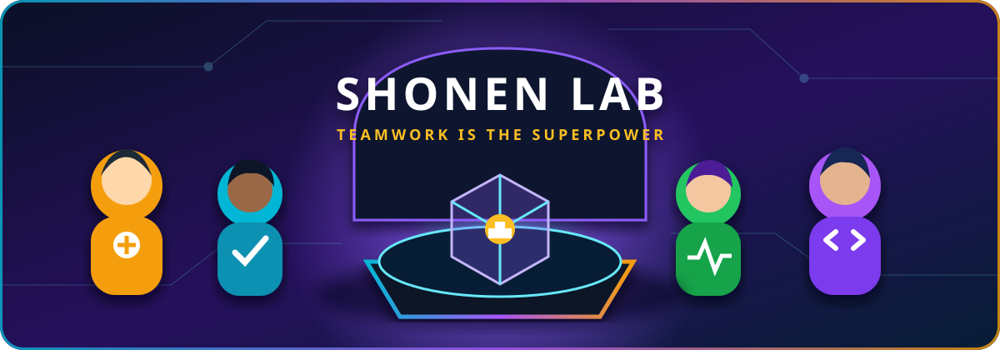
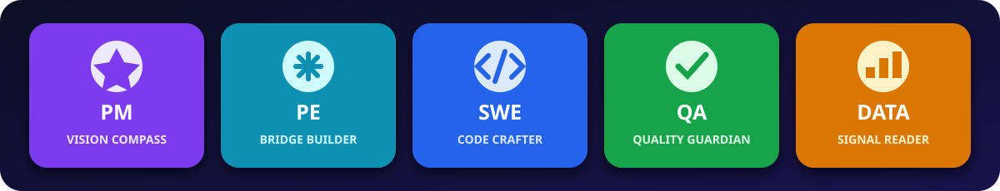

<div align="center">



# 🎌 Shonen Lab

### Build together. Test with evidence. Level up every workflow. ⚡


</div>

Shonen Lab is a growing marketplace of reusable Codex plugins and skills for product managers, product engineers, software engineers, QA engineers, analytics teams, and anyone who enjoys turning repetitive work into a reliable power-up. 🚀

> 🛡️ **Built to travel safely:** plugins stay organization-independent. Workspace databases, project IDs, URLs, credentials, customer data, and product-specific configuration never belong in repository files; setup happens at first run.

## 🌌 Inside the lab

<div align="center">


<sub>Original Shonen Lab artwork—five roles, one glowing workbench, unlimited power-ups. ✨</sub>

</div>

## 🦸 Choose your power-up



| Role | Power-up |
| --- | --- |
| 🧭 **PM** | Turn repeatable product routines into guided workflows. |
| ⚙️ **PE** | Connect product context to practical implementation and validation. |
| 💻 **SWE** | Automate technical checks without losing review boundaries. |
| 🧪 **QA** | Verify behavior with evidence and consistent verdict rules. |
| 📊 **Analytics** | Connect tracking plans to observed product data. |

## 🧰 Plugin inventory

| Plugin | Best for | Mission |
| --- | --- | --- |
| [⚡ Tracking Event QA](plugins/tracking-event-qa/README.md) | PM · PE · SWE · QA · Analytics | Verify tracking-plan events on every channel they are routed to, and record evidence in Notion. |

More quests are welcome—each plugin lives in its own directory and joins the shared marketplace catalog. 🌟

## 🚀 Start your quest

Replace `<owner>` and `<repository>` with the GitHub location used by your team:

```bash
codex plugin marketplace add <owner>/<repository> --ref main
codex plugin add tracking-event-qa@shonen-lab
```

Start a new Codex task after installing or updating a plugin so its skills and tools are loaded.

### First mission: Tracking Event QA

```text
$setup-tracking-event-qa
$verify-tracking-events
```

1. 🎯 **Configure** a reusable squad/product profile.
2. 🔍 **Inspect** the selected Notion and PostHog sources.
3. 🧪 **Verify** each event × platform result with real evidence.
4. 📝 **Preview** scoped write-back before anything changes.
5. 🆙 **Repeat** the routine whenever the tracking plan returns to QA.

## 🗺️ Lab map

```text
.agents/plugins/marketplace.json    🎌 Marketplace catalog
plugins/<plugin-name>/              🧩 Self-contained plugin
  .codex-plugin/plugin.json         🪪 Plugin manifest
  skills/                           ⚡ Reusable capabilities
  scripts/                          🤖 Deterministic helpers
  references/                       📚 Operating rules
assets/                             🎨 README artwork
```

## 🥋 Dojo rules

- 🌍 Keep every plugin independent of any company, product, squad, or repository.
- 🔐 Never commit credentials, tokens, internal URLs, IDs, or customer data.
- 🧭 Collect workspace-specific choices through an explicit setup workflow.
- 👀 Preview consequential write actions and keep them tightly scoped.
- ✅ Validate the plugin, its skills, and helper scripts before sharing.
- 📖 Document requirements, safety boundaries, and a clear first mission.

## 🛠️ Create the next power-up

1. Create a lower-case, hyphenated directory under `plugins/`.
2. Add and validate `.codex-plugin/plugin.json`.
3. Include only the skills, scripts, references, MCP configuration, or apps the workflow needs.
4. Register the plugin in `.agents/plugins/marketplace.json`.
5. Run privacy, secret, and validation checks.
6. Open a pull request and tell the team what new ability they unlocked. 🎉

Read [CONTRIBUTING.md](CONTRIBUTING.md) for the review checklist and [SECURITY.md](SECURITY.md) for data-handling rules.

<div align="center">

**✨ Small automations. Stronger teams. Better adventures. ✨**

</div>
